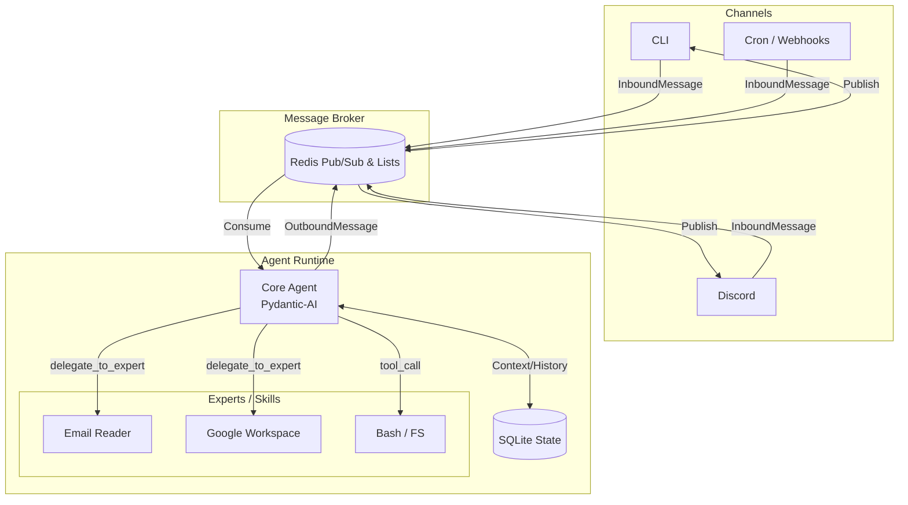

# Fergusson: Omnipotent Personal Assistant

Fergusson is a highly modular, Python-native personal AI assistant. It acts as a centralized gateway routing messages between multiple channels (Discord, CLI, Cron) and an intelligent Pydantic-AI core agent capable of delegating specialized tasks to isolated sub-agents (Experts).

## Architecture

Fergusson leverages a distributed, event-driven architecture powered by Redis and Pydantic-AI.

### Core Components
1. **Redis Broker**: Acts as the central nervous system decoupling the ingress channels from the LLM execution loop.
2. **Channel Ingress**: Independent scripts or async tasks (e.g., Discord WebSocket client, CLI loop) that publish standardized `InboundMessage` objects to the broker.
3. **Core Agent**: An "omnipotent" router built on `pydantic-ai`. It handles intent recognition, maintains conversation state (via local SQLite), and decides whether to use native tools or delegate.
4. **Skills/Sub-Agents**: Dynamically loaded experts based on the [Claude Code Skills standard](https://code.claude.com/docs/en/skills) (`SKILL.md` with YAML frontmatter). The Core Agent spawns these via Agent-to-Agent (A2A) delegation.

## Why Fergusson? (vs. Nanobot or OpenClaw)

While projects like [Nanobot](https://github.com/HKUDS/nanobot) and [OpenClaw](https://github.com/openclaw/openclaw) offer interesting approaches to personal AI, Fergusson's architecture solves specific scaling and reliability pain points.

### The "Goldilocks" Zone of Agent Design

**1. Type-Safe Reliability (vs. Nanobot)**
Nanobot relies on a monolithic loop, simple string prompts, and file-based state (e.g., `HEARTBEAT.md`). Fergusson utilizes **Pydantic-AI**, enforcing strict schema validation for agent inputs, tool definitions, and A2A delegation. This eliminates hallucinations of malformed tool calls and makes data structures 100% predictable.

**2. Distributed Orchestration (vs. OpenClaw & Nanobot)**
OpenClaw uses a highly complex custom WebSocket gateway written in TypeScript. Nanobot runs everything in a single Python process. Fergusson uses **Redis as an enterprise-grade message broker**. This completely decouples the channels from the agent logic. A heavy tool execution or a crash in the Discord channel will not block the CLI or the Core Agent. 

**3. Python-Native AI Ecosystem (vs. OpenClaw)**
OpenClaw's heavy TypeScript ecosystem creates friction when trying to integrate modern Python AI libraries (HuggingFace, PyTorch, Pandas). Fergusson remains purely Python-native, meaning any new AI research tool can be wrapped as a Pydantic-AI skill in minutes.

**4. True Sub-Agent Isolation**
Instead of dumping all tools into one massive LLM context window, Fergusson uses Progressive Disclosure via the `SKILL.md` registry. The Core Agent only knows the *metadata* of an expert. When required, an isolated Pydantic-AI sub-agent is instantiated with its own specific system prompt and focused toolset, drastically reducing token usage and context confusion.
