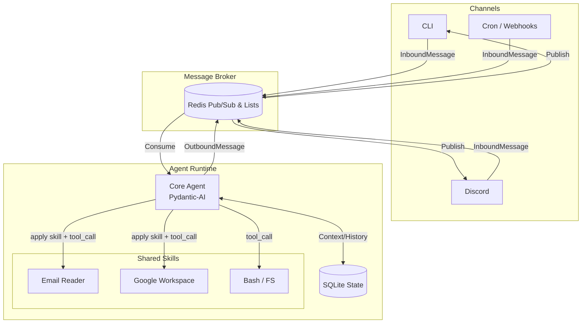

# Fergusson: Omnipotent Personal Assistant

Fergusson is a highly modular, Python-native personal AI assistant. It acts as a centralized gateway routing messages between multiple channels (Discord, CLI, Cron) and a Pydantic-AI core agent that applies shared skills and tools directly.

## Architecture

Fergusson leverages a distributed, event-driven architecture powered by Redis and Pydantic-AI.


```mermaid
graph TD
    subgraph Channels
        C_CLI[CLI]
        C_Discord[Discord]
        C_Cron[Cron / Webhooks]
    end

    subgraph Message Broker
        Redis[(Redis Pub/Sub & Lists)]
    end

    subgraph Agent Runtime
        Core[Core Agent \n Pydantic-AI]
        Mem[(SQLite State)]
        
        subgraph Shared Skills
            E_Email[Email Reader]
            E_Gog[Google Workspace]
            E_Bash[Bash / FS]
        end
    end

    %% Flow
    C_CLI -->|InboundMessage| Redis
    C_Discord -->|InboundMessage| Redis
    C_Cron -->|InboundMessage| Redis
    
    Redis -->|Consume| Core
    Core <-->|Context/History| Mem
    
    Core -->|apply skill + tool_call| E_Email
    Core -->|apply skill + tool_call| E_Gog
    Core -->|tool_call| E_Bash
    
    Core -->|OutboundMessage| Redis
    
    Redis -->|Publish| C_CLI
    Redis -->|Publish| C_Discord
```

### Core Components
1. **Redis Broker**: Acts as the central nervous system decoupling the ingress channels from the LLM execution loop.
2. **Channel Ingress**: Independent scripts or async tasks (e.g., Discord WebSocket client, CLI loop) that publish standardized `InboundMessage` objects to the broker.
3. **Core Agent**: An "omnipotent" runtime agent built on `pydantic-ai`. It handles intent recognition, maintains conversation state (via local SQLite), and decides which native tools and skills to apply.
4. **Skills**: Dynamically loaded instructions based on the [Claude Code Skills standard](https://code.claude.com/docs/en/skills) (`SKILL.md` with YAML frontmatter). Skills are loaded into agent context instead of being spawned as separate per-skill agents.

## Model Configuration

Model selection is configured directly from environment variables using native PydanticAI `provider:model` strings.

```bash
export SMART_MODEL="google-gla:gemini-3-pro-preview"
export FAST_MODEL="openai:gpt-4.1-mini"
```

- `SMART_MODEL` is used by the core agent and archiver.
- `FAST_MODEL` is used by lightweight helper flows such as voice rewriting.
- `workspace/config/config.json` now configures only non-model runtime settings such as enabled channels and MCP servers.
- Custom Fergusson provider aliases are no longer supported; use native PydanticAI model strings such as `openai:...`, `google-gla:...`, or `gateway/...`.

## Why Fergusson? (vs. Nanobot or OpenClaw)

While projects like [Nanobot](https://github.com/HKUDS/nanobot) and [OpenClaw](https://github.com/openclaw/openclaw) offer interesting approaches to personal AI, Fergusson's architecture solves specific scaling and reliability pain points.

### The "Goldilocks" Zone of Agent Design

**1. Type-Safe Reliability (vs. Nanobot)**
Nanobot relies on a monolithic loop, simple string prompts, and file-based state (e.g., `HEARTBEAT.md`). Fergusson utilizes **Pydantic-AI**, enforcing strict schema validation for agent inputs, tool definitions, and tool execution. This eliminates hallucinations of malformed tool calls and makes data structures 100% predictable.

**2. Distributed Orchestration (vs. OpenClaw & Nanobot)**
OpenClaw uses a highly complex custom WebSocket gateway written in TypeScript. Nanobot runs everything in a single Python process. Fergusson uses **Redis as an enterprise-grade message broker**. This completely decouples the channels from the agent logic. A heavy tool execution or a crash in the Discord channel will not block the CLI or the Core Agent. 

**3. Python-Native AI Ecosystem (vs. OpenClaw)**
OpenClaw's heavy TypeScript ecosystem creates friction when trying to integrate modern Python AI libraries (HuggingFace, PyTorch, Pandas). Fergusson remains purely Python-native, meaning any new AI research tool can be wrapped as a Pydantic-AI skill in minutes.

**4. Shared Skill Workflows**
Instead of creating a separate agent for every skill, Fergusson keeps skills as reusable instructions that the runtime agent can apply alongside the shared toolset. This keeps behavior consistent while still letting the runtime discover skills dynamically from the `SKILL.md` registry.
