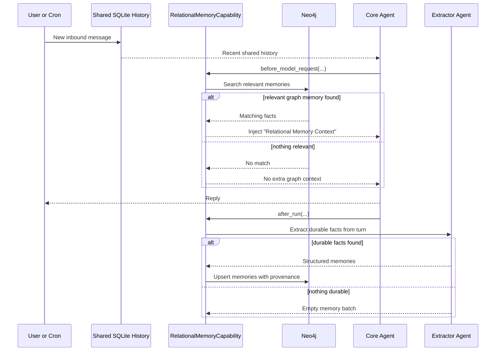
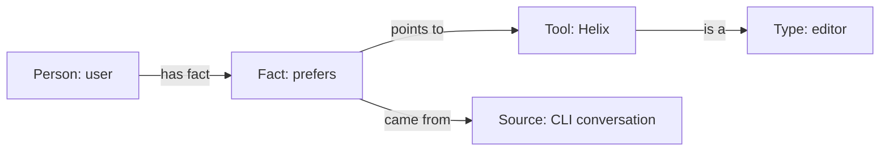

# Relational Memory

This document explains the Neo4j-based memory in simple terms.

## What It Is

Fergusson now has a second kind of memory besides normal chat history:

- SQLite keeps the recent conversation thread.
- `MEMORY.md` keeps human-written notes and preferences.
- Neo4j keeps structured facts and relationships.

Think of Neo4j memory as a small knowledge graph:

- “the user prefers Helix”
- “Rubint works with Metrotech”
- “the primary channel is Discord”

Instead of saving those as loose paragraphs, it saves them as connected pieces.

## What Problem It Solves

Normal chat history is good for recent context, but not ideal for durable facts.

Example:

- you tell the assistant today that your favorite editor is Helix
- a week later the short-term thread may be compacted
- but that preference is still something the assistant should remember

Relational memory is meant to hold that kind of durable information.

## How The File Works

The implementation lives in [src/agent/relational_memory.py](/home/odroid/fergusson/src/agent/relational_memory.py).

It has two main parts:

1. `RelationalMemoryStore`
   Talks to Neo4j, creates constraints, searches memories, and writes/upserts memories.

2. `RelationalMemoryCapability`
   Plugs into PydanticAI as an agent capability.
   It adds tools, injects relevant memory before a model request, and extracts new durable memories after a successful run.

## High-Level Flow

## What Gets Stored

The storage model is intentionally simple:

- `MemoryEntity`
  A thing or person, such as `user`, `rubint`, `metrotech`

- `MemoryAssertion`
  A fact about an entity, such as `preferred_editor = Helix`

- `OBJECT` relation
  Used when the right-hand side is another entity instead of plain text

That means the graph can represent both:

- scalar facts
  Example: `user -> preferred_editor -> Helix`

- entity relationships
  Example: `rubint -> works_with -> metrotech`

## Example Memory Piece

If you say:

> Remember that my favorite editor is Helix.

In plain terms, the graph is trying to store a small connected idea, not just one sentence.

That can mean:

- there is a person called `user`
- that person prefers `Helix`
- `Helix` is an editor
- this fact came from a conversation in CLI

Visually, one stored memory neighborhood can look like this:

If later you say:

> I switched to Neovim.

The old `preferred_editor = Helix` assertion is not deleted. It is marked `superseded`, and a new active assertion is created for `Neovim`.

So the assistant keeps history of the fact, but uses the newest version.

## How Search Works

Before the model answers, the capability:

1. checks whether Neo4j is available
2. extracts the latest user text from the request
3. searches graph memories for matching names, predicates, aliases, and values
4. if something relevant is found, inserts a short `# Relational Memory Context` block into the prompt

This means the model does not need to guess or manually reload everything from raw history if the fact is already in graph memory.

## How Writing Works

There are two ways new memories get written.

### 1. Explicit tool call

The agent can call:

- `search_relational_memory(...)`
- `upsert_relational_memory(...)`

This is for cases where it wants to deliberately inspect or store a fact.

### 2. Automatic extraction after a turn

After a successful response, a small extractor agent reviews:

- the latest user message
- the assistant’s reply

Then it decides whether there are durable facts worth saving.

It is instructed to keep things selective:

- save preferences, identities, relationships, stable facts
- ignore temporary plans, tool failures, one-off errors, and weak guesses

## How It Affects The Agent

In practice, this changes the agent in three ways.

### 1. Better recall of durable facts

The agent can answer questions like:

- “What editor do I prefer?”
- “Who does Rubint work with?”
- “What did I say my primary channel is?”

without depending only on recent chat history.

### 2. More stable behavior across channel switches

Because the graph memory is not tied to one specific message window, it helps when you continue the same personal-assistant flow across CLI, Discord, and cron-driven updates.

### 3. Provenance-aware memory

Each stored fact includes where it came from:

- user or system/cron
- channel
- run reference

That makes the memory more auditable and safer to update.

## Neo4j Availability Behavior

Neo4j is optional.

If the connection is not configured or verification fails:

- the assistant does not crash
- graph memory is disabled
- the agent falls back to normal SQLite history and `MEMORY.md`

So relational memory is an enhancement, not a hard dependency.

## Plain-English Summary

SQLite answers “what were we just talking about?”

`MEMORY.md` answers “what important notes did we write down manually?”

Neo4j relational memory answers “what durable facts and relationships should the assistant know about the world and the user?”
